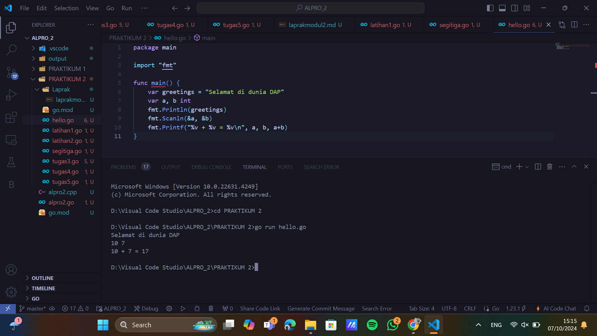
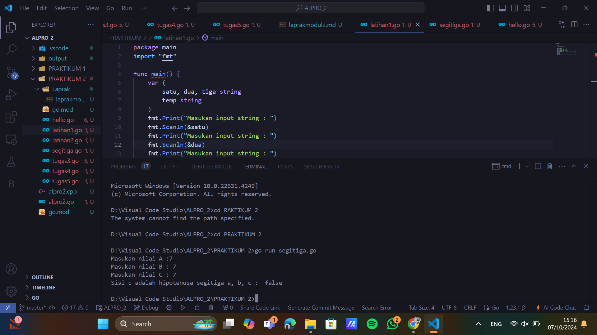
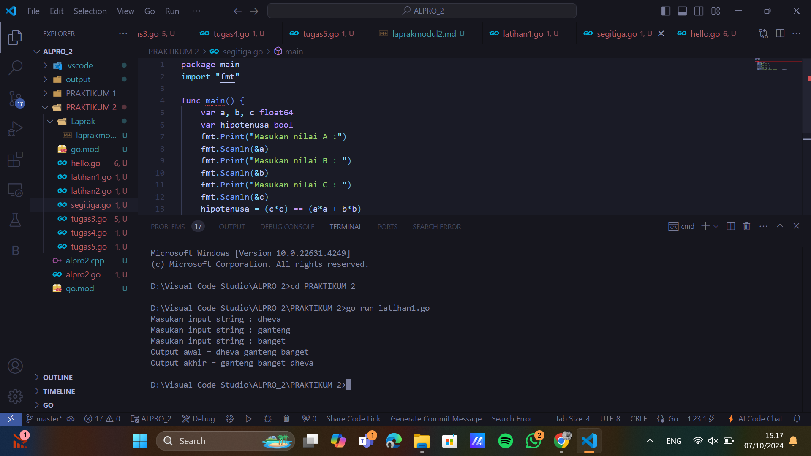
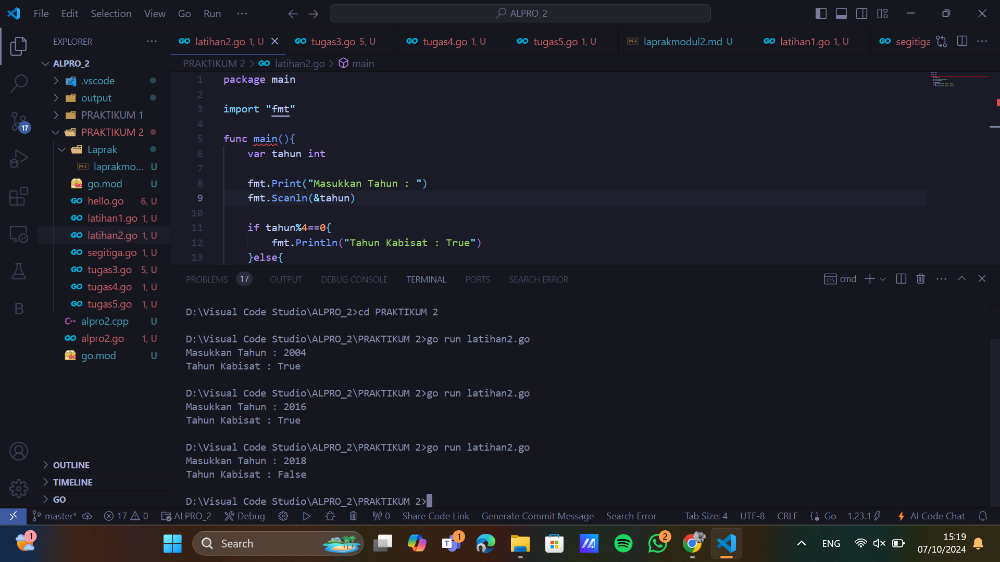
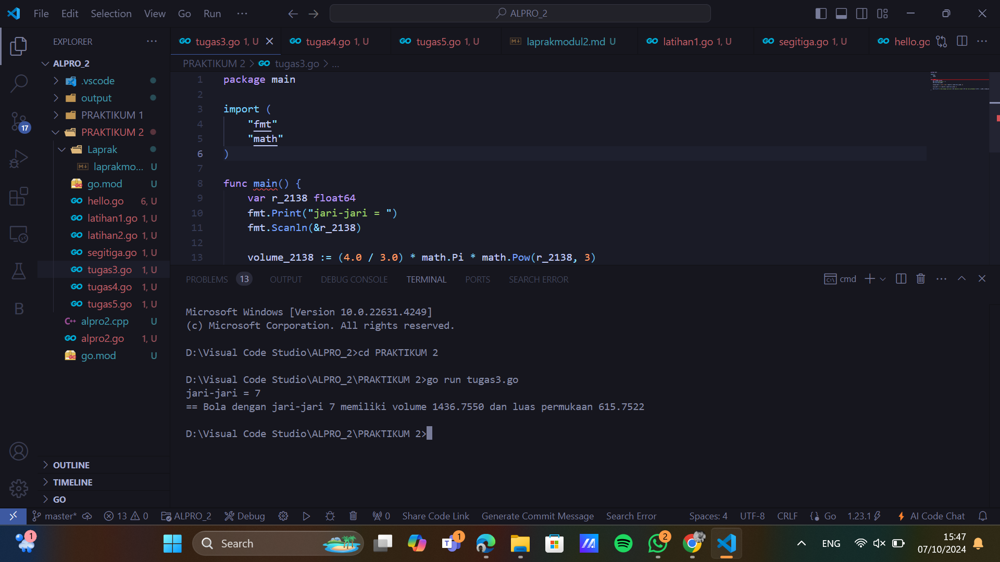
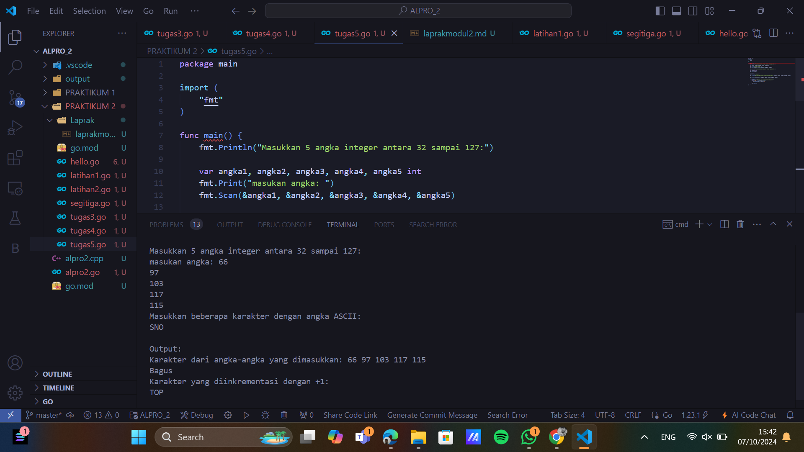

# <h1 align="center">Laporan Praktikum 2 "Riview Struktur Kontrol" </h1>
<p align="center">Dheva Dewa Septiantoni - 2311102324</p>


## Hello World

```go
package main

import "fmt"

func main() {
	var greetings = "Selamat di dunia DAP"
	var a, b int
	fmt.Println(greetings)
	fmt.Scanln(&a, &b)
	fmt.Printf("%v + %v = %v\n", a, b, a+b)
}

```

### Output:



## Segitiga

```go
package main
import "fmt"

func main() {
	var a, b, c float64
	var hipotenusa bool
	fmt.Print("Masukan nilai A :")
	fmt.Scanln(&a)
	fmt.Print("Masukan nilai B : ")
	fmt.Scanln(&b)
	fmt.Print("Masukan nilai C : ")
	fmt.Scanln(&c)
	hipotenusa = (c*c) == (a*a + b*b)
	fmt.Println("Sisi c adalah hipotenusa segitiga a, b, c : ", hipotenusa)
}

```

### Output:



## Latihan 1

```go
package main

package main
import "fmt"

func main() {
	var (
		satu, dua, tiga string
		temp string
	)
	fmt.Print("Masukan input string : ")
	fmt.Scanln(&satu)
	fmt.Print("Masukan input string : ")
	fmt.Scanln(&dua)
	fmt.Print("Masukan input string : ")
	fmt.Scanln(&tiga)
	fmt.Println("Output awal = " + satu + " " + dua + " " + tiga)
	temp = satu
	satu = dua
	dua = tiga
	tiga = temp
	fmt.Println("Output akhir = " + satu + " " + dua + " " + tiga)
}

```

### Output:



## Latihan 2

```go
package main

package main

import "fmt"

func main(){
	var tahun int

	fmt.Print("Masukkan Tahun : ")
	fmt.Scanln(&tahun)

	if tahun%4==0{
		fmt.Println("Tahun Kabisat : True")
	}else{
		fmt.Println("Tahun Kabisat : False")
	}
}

```

### Output:



## Tugas 3

```go
package main

import (
	"fmt"
	"math"
)

const pi = 3.1415926535

func main() {
	var radius int
	fmt.Print("Jarijari=")
	fmt.Scan(&radius)

	volume = 4.0 / 3.0 * pi * math.Pow(float64(radius), 3)
	surfaceArea = 4 * pi * math.Pow(float64(radius), 2)

	fmt.Printf("Bola dengan jari-jari %d memiliki volume %.4f dan luas kulit %.4f\n", radius, volume, surfaceArea)
}

```

### Output:



## Latihan 4

```go
package main

import (
	"fmt"
)

func main() {
	var celcius, fahrenheit, kelvin, reamur float64

	fmt.Print("Temperatur celcius: ")
	fmt.Scanln(&celcius)
	reamur = celcius * 4 / 5
	fahrenheit = (celcius * 9 / 5) + 32
	kelvin = celcius + 273.15

	fmt.Println("Derajat reamur: ", reamur)
	fmt.Println("Derajat fahrenheit: ", fahrenheit)
	fmt.Println("Derajat kelvin: ", kelvin)

}
```

### Output:


## Latihan 5

```go

package main

import (
	"fmt"
)

func main() {
	fmt.Println("Masukkan 5 angka integer antara 32 sampai 127:")

	var angka1, angka2, angka3, angka4, angka5 int
	fmt.Print("masukan angka: ")
	fmt.Scan(&angka1, &angka2, &angka3, &angka4, &angka5)

	fmt.Println("Masukkan beberapa karakter dengan angka ASCII:")

	var input string
	fmt.Scan(&input)

	// Output
	fmt.Println("\nOutput:")

	fmt.Println("Karakter dari angka-angka yang dimasukkan:", angka1, angka2, angka3, angka4, angka5)

	fmt.Printf("%c%c%c%c%c\n", angka1, angka2, angka3, angka4, angka5)

	if len(input) > 0 {
		fmt.Println("Karakter yang diinkrementasi dengan +1:")
		for i := 0; i < len(input); i++ {
			fmt.Printf("%c", input[i]+1)
		}
		fmt.Println()
	}
}


```

### Output:




