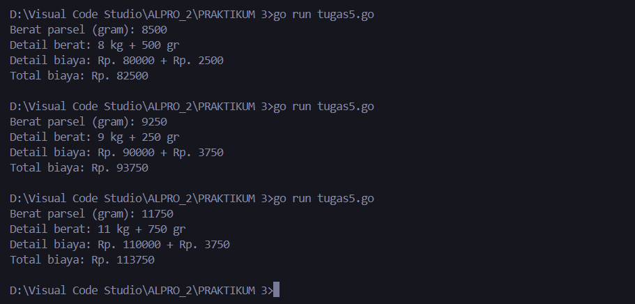

# <h1 align="center">Laporan Praktikum Modul 3 PERULANGAN & PERCABANGAN</h1>

<h2 align="center">PERTEMUAN 3</h2>
<h2 align="center">PERULANGAN & PERCABANGAN</h2>
<h3 align="center">Hamid Sabirin-2311102129</h3>

### 1. Latihan1

```go
package main

import "fmt"

func main() {
	urutanBenar := []string{"merah", "kuning", "hijau", "ungu"}
	hasil := true

	for i := 1; i <= 5; i++ {
		var warna1, warna2, warna3, warna4 string
		fmt.Printf("percobaan %d\n ", i)
		fmt.Print("masukkan warna pertama: ")
		fmt.Scan(&warna1)
		fmt.Print("masukkan warna kedua: ")
		fmt.Scan(&warna2)
		fmt.Print("masukkan warna ketiga: ")
		fmt.Scan(&warna3)
		fmt.Print("masukkan warna keempat: ")
		fmt.Scan(&warna4)

		if warna1 != urutanBenar[0] || warna2 != urutanBenar[1] || warna3 != urutanBenar[2] || warna4 != urutanBenar[3] {
			hasil = false
		}
	}
	println("BERHASIL", hasil)
}
```

### Output Screenshot:


### 2. Latihan2

```go
package main

import (
	"bufio"
	"fmt"
	"os"
	"strings"
)

func main() {
	scanner := bufio.NewScanner(os.Stdin)
	var pita string
	var bungaCount int

	for {
		fmt.Printf("bunga %d: ", bungaCount+1)
		scanner.Scan()
		input := scanner.Text()
		if strings.ToLower(input) == "selesai" {
			break
		}

		if pita == "" {
			pita = input
		} else {
			pita += "-" + input
		}
		bungaCount++
	}
	fmt.Printf("pita : %s\n", pita)
	fmt.Printf("bunga : %d\n", bungaCount)
}
```

### Output Screenshot:


### 3. Tugas 3

```go

package main

import "fmt"

func main() {
	for {
		var beratKiri, beratKanan float64
		fmt.Print("Masukan berat belanjaan di kedua kantong: ")
		fmt.Scanln(&beratKiri, &beratKanan)

		if beratKiri < 0 || beratKanan < 0 || beratKiri+beratKanan > 150 {
			fmt.Println("Proses selesai.")
			break
		}

		if beratKiri-beratKanan >= 9 || beratKanan-beratKiri >= 9 {
			fmt.Println("Sepeda motor pak Andi akan oleng: true")
		} else {
			fmt.Println("Sepeda motor pak Andi akan oleng: false")
		}
	}
}


```

### Output Screenshot:


### 4. Tugas 4

```go

package main

import (
	"fmt"
	"math"
)

// Fungsi untuk menghitung f(k)
func f(k float64) float64 {
	numerator := math.Pow((4*k + 2), 2)
	denominator := (4*k + 1) * (4*k + 3)
	return numerator / denominator
}

func sqrt2(k int) float64 {
	result := 1.0
	for i := 0; i <= k; i++ {
		result *= f(float64(i))
	}
	return result
}

func main() {
	var K int

	for i := 1; i <= 3; i++ {
		fmt.Print("Nilai K = ")
		fmt.Scan(&K)

		approxSqrt2 := sqrt2(K)
		fmt.Printf("Nilai akar 2 = %.10f\n\n", approxSqrt2)
	}

	fmt.Println("Proses selesai.")
}

```

### Output Screenshot:


### 5. Tugas 5

```go
package main

import "fmt"

func main() {
	var beratParsel int
	fmt.Print("Berat parsel (gram): ")
	fmt.Scanln(&beratParsel)

	kg := beratParsel / 1000
	gram := beratParsel % 1000

	biayaKg := kg * 10000
	biayaGram := 0
	if gram >= 500 {
		biayaGram = gram * 5
	} else if gram > 0 && gram < 500 {
		biayaGram = gram * 15
	}

	totalBiaya := biayaKg + biayaGram
	if kg > 10 && gram > 0 && gram < 500 {
		totalBiaya = totalBiaya - (gram * 15)
	}

	fmt.Println("Detail berat:", kg, "kg +", gram, "gr")
	fmt.Println("Detail biaya: Rp.", biayaKg, "+ Rp.", biayaGram)
	fmt.Println("Total biaya: Rp.", totalBiaya)
}

```

### Output Screenshot:



### 6. Tugas 6

#### 6A

```go
// Sebelum Di Perbaiki
package main

import "fmt"

func main() {
    var nam float64
    var nmk string
    fmt.Print("Nilai akhir mata kuliah: ")
    fmt.Scanln(&nam)

    if nam > 80 {
        nam = "A"
    }
    if nam > 72.5 {
        nam = "AB"
    }
    if nam > 65 {
        nam = "B"
    }
    if nam > 57.5 {
        nam = "BC"
    }
    if nam > 50 {
        nam = "C"
    }
    if nam > 40 {
        nam = "D"
    } else if nam <= 40 {
        nam = "E"
    }

    fmt.Println("Nilai mata kuliah: ", nmk)
}

```

### Output Screenshot:


#### 6b

A. Daftar Kesalahan:

1. Penggunaan variabel yang salah (nam diubah menjadi string):
2. Output menggunakan variabel yang salah (nmk tidak pernah diisi):
3. Kondisi terpisah tanpa else if:
4. Masalah logika pada kondisi if nam <= 40:

B. Kenapa seperti itu?

1. Tipe Data Tidak Sesuai
- Kesalahan: 
Program mencoba menyimpan nilai string (seperti "A", "AB", dll.) ke dalam variabel nam yang bertipe float64. Ini tidak diperbolehkan dalam Go karena tipe data harus konsisten. float64 hanya dapat menyimpan nilai numerik, bukan string.

2. Urutan Logika yang Tidak Efisien (Tanpa else if)
- Kesalahan: 
Menggunakan if secara berurutan tanpa else if menyebabkan semua kondisi dievaluasi, meskipun sudah ada satu kondisi yang benar. Ini bisa membuat program mengevaluasi kondisi yang tidak perlu dan menyebabkan nilai nmk berubah tidak sesuai.

3. Variabel nmk Tidak Pernah Diinisialisasi
- Kesalahan: 
Variabel nmk dideklarasikan tetapi tidak pernah diisi atau diinisialisasi dengan nilai. Akibatnya, ketika program mencoba mencetak nilai nmk, hasilnya adalah string kosong.


C. Alur Program Seharusnya :

Program seharusnya menanyakan nilai akhir mata kuliah dari pengguna dan kemudian menentukan nilai huruf berdasarkan rentang nilai tersebut. 
Berikut adalah alur program yang benar:
1. Menerima input nilai akhir mata kuliah.
2. Menggunakan else if untuk memastikan hanya satu kondisi yang dievaluasi.
3. Menggunakan variabel terpisah untuk menyimpan nilai huruf (nmk).
4. Mencetak nilai huruf berdasarkan nilai numerik.

#### 6c

```go

// Sesudah Di Perbaiki
package main

import ("fmt")

func main() {
	var nam float64
	var nmk string
	fmt.Print("Nilai akhir mata kuliah: ")
	fmt.Scanln(&nam)
	if nam > 80 {
		nmk = "A"
	} else if nam > 72.5 && nam <= 80 {
		nmk = "AB"
	} else if nam > 65 && nam <= 72.5 {
		nmk = "B"
	} else if nam > 57.5 && nam <= 65 {
		nmk = "BC"
	} else if nam > 50 && nam <= 57.5 {
		nmk = "C"
	} else if nam > 40 && nam <= 50 {
		nmk = "D"
	} else if nam <= 40 {
		nmk = "E"
	}
	fmt.Println("Nilai mata kuliah: ", nmk)
}


```

### Output Screenshot:


### 8. Tugas5

```go

package main

import "fmt"

func main() {
	var number int
	fmt.Print("Bilangan: ")
	fmt.Scanln(&number)

	fmt.Print("Faktor: ")
	for i := 1; i <= number; i++ {
		if number%i == 0 {
			fmt.Print(i, " ")
		}
	}
	fmt.Println()

	isPrime := true
	if number <= 1 {
		isPrime = false
	} else {
		for i := 2; i*i <= number; i++ {
			if number%i == 0 {
				isPrime = false
				break
			}
		}
	}

	fmt.Println("Prima:", isPrime)
}

```

### Output Screenshot:

