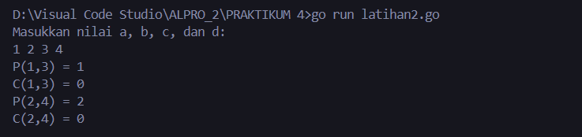
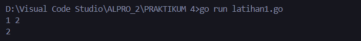
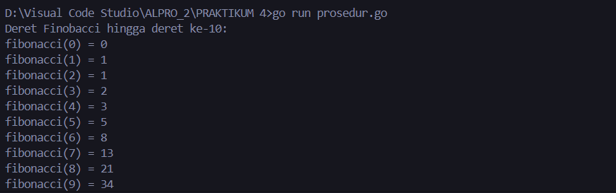
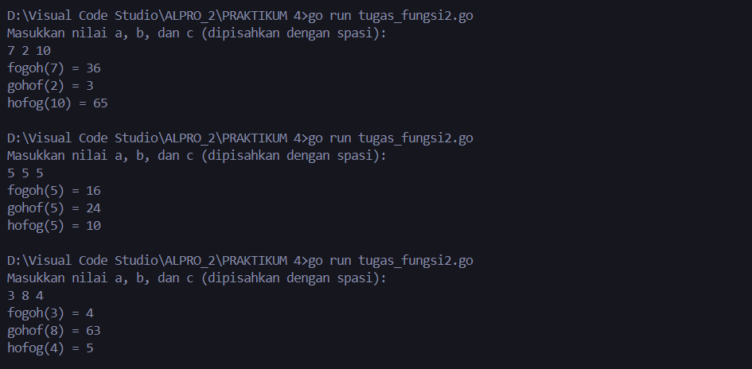
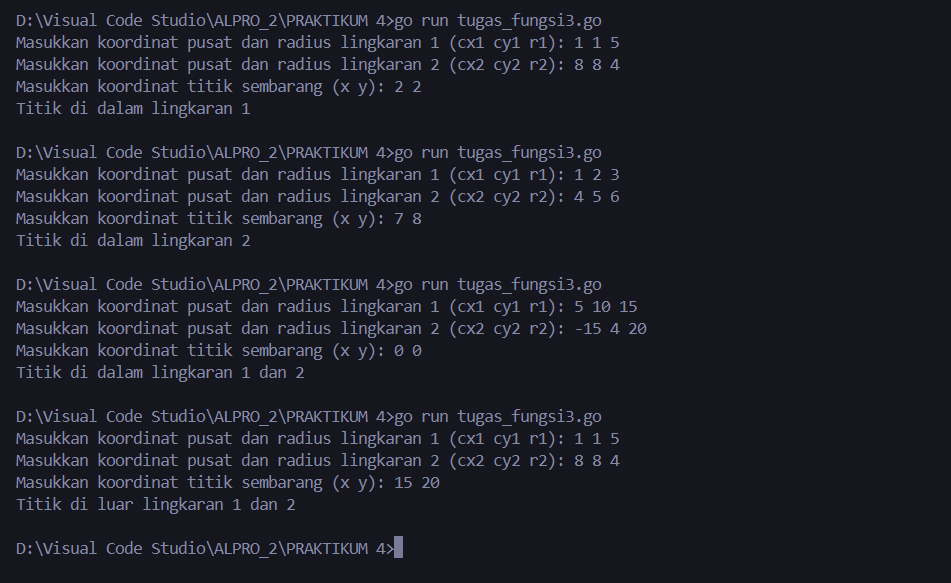
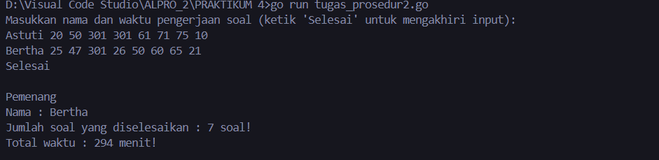
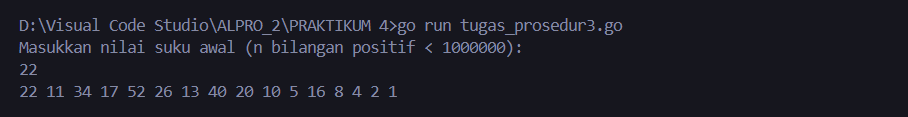

# <h1 align="center">LAPORAN PRAKTIKUM MODUL 4 : FUNGSI DAN PROSEDUR</h1>
## <p align="center">DHEVA DEWA SEPTIANTONI - 2311102324</p>

# LATIHAN
## 1. Fungsi.go

```go
package main

import "fmt"

func factorial(n int) int {
	if n == 0 || n == 1 {
		return 1
	}
	result := 1
	for i := 2; i <= n; i++ {
		result *= i
	}
	return result
}

func permutation(n, r int) int {
	return factorial(n) / factorial(n-r)
}

func combination(n, r int) int {
	return factorial(n) / (factorial(r) * factorial(n-r))
}

func main() {
	var a, b, c, d int

	fmt.Println("Masukkan nilai a, b, c, dan d:")
	fmt.Scan(&a, &b, &c, &d)

	// Menghitung permutasi
	p1 := permutation(a, c)
	c1 := combination(a, c)

	// Menghitung permutasi
	p2 := permutation(b, d)
	c2 := combination(b, d)

	// Output hasil
	fmt.Printf("P(%d,%d) = %d\n", a, c, p1)
	fmt.Printf("C(%d,%d) = %d\n", a, c, c1)
	fmt.Printf("P(%d,%d) = %d\n", b, d, p2)
	fmt.Printf("C(%d,%d) = %d\n", b, d, c2)
}

```
### OUTPUT SCREENSHOT


Kode di atas digunakan untuk implementasi dari kalkulasi permutasi dan kombinasi menggunakan bahasa Go. Fungsi `factorial` digunakan untuk menghitung faktorial dari sebuah bilangan, yang kemudian digunakan dalam fungsi `permutation` dan `combination`. Program ini meminta pengguna untuk memasukkan empat nilai (`a`, `b`, `c`, dan `d`), dan kemudian menghitung serta menampilkan hasil dari permutasi dan kombinasi untuk nilai yang dimasukkan. Hasil permutasi dan kombinasi dicetak dalam bentuk `P(n, r)` dan `C(n, r)` masing-masing untuk pasangan nilai yang diberikan.. Lebih jelasnya seperti pada output diatas.

## 2. Latihan1.go

```go
package main

import "fmt"

func main() {
	var a, b int
	fmt.Scan(&a, &b)
	if a >= b {
		fmt.Println(permutasi(a, b))
	} else {
		fmt.Println(permutasi(b, a))
	}
}
func factorial(n int) int {
	var hasil int = 1
	var i int
	for i = 1; i <= n; i++ {
		hasil = hasil * i
	}
	return hasil
}
func permutasi(n, r int) int {
	return factorial(n) / factorial(n-r)
}

```
### OUTPUT SCREENSHOT


Kode di atas digunakan untuk meminta dua angka dari pengguna, lalu menghitung permutasi dari angka yang lebih besar dengan angka yang lebih kecil menggunakan fungsi faktorial, dan menampilkan hasilnya. Lebih jelasnya seperti pada output diatas.

## 3. Prosedur.go

```go
package main

import (
	"fmt"
)

// fungsi rekursif untuk menghitung deret fibonaci
func fibonacci(n int) int {
	if n == 0 {
		return 0
	} else if n == 1 {
		return 1
	} else {
		return fibonacci(n-1) + fibonacci(n-2)
	}
}

func main() {
	//menampilkan deret fibonacci hingga suku ke-10
	fmt.Println("Deret fibonacci hingga suku ke-10: ")
	for i := 0; i <= 10; i++ {
		fmt.Printf("Fibonacci (%d) = %d\n", i, fibonacci(i))
	}
}


```
### OUTPUT SCREENSHOT


Kode di atas digunakan untuk menghitung dan menampilkan deret Fibonacci hingga suku ke-10 menggunakan fungsi rekursif. Fungsi `fibonacci` digunakan untuk menghitung nilai Fibonacci berdasarkan nomor urut yang diberikan. Dalam fungsi `main`, prosedur dipanggil untuk menampilkan nilai Fibonacci dari suku ke-0 hingga ke-10. Lebih jelasnya seperti pada output diatas.

# TUGAS
## 1. Tugas Fungsi No2

```go

// PROGRAM 3 BUAH FUNGSI MATEMATIKA (Fogoh, Gohof, Hofog) 
package main 
 
import ( 
    "fmt" 
) 
 
// Fungsi f mengkuadratkan nilai input 
func f(x_324 int) int { // Mengkuadratkan nilai x_324 
    return x_324 * x_324 
} 
 
// Fungsi g mengurangi 2 dari nilai input 
func g(x_324 int) int { // Mengurangi nilai x_324 dengan 2 
    return x_324 - 2 
} 
 
// Fungsi h menambah 1 ke nilai input 
func h(x_324 int) int { // Menambah nilai x_324 dengan 1 
    return x_324 + 1 
} 
 
// Fungsi fogoh menerapkan f ke hasil dari g yang diterapkan pada h dari x_324 
func fogoh(x_324 int) int { // Menerapkan f(g(h(x_324))) 
    return f(g(h(x_324))) 
} 
 
// Fungsi gohof menerapkan g ke hasil dari h yang diterapkan pada f dari x_324 
func gohof(x_324 int) int { // Menerapkan g(h(f(x_324))) 
    return g(h(f(x_324))) 
} 
 
// Fungsi hofog menerapkan h ke hasil dari f yang diterapkan pada g dari x_324 
func hofog(x_324 int) int { // Menerapkan h(f(g(x_324))) 
    return h(f(g(x_324))) 
} 
 
func main() { 
    var a_324, b_324, c_324 int 
 
    // Meminta pengguna untuk memasukkan nilai a_324, b_324, dan c_324 dalam satu baris dipisahkan oleh spasi 
    fmt.Println("Masukkan nilai a, b, dan c (dipisahkan dengan spasi): ") 
    fmt.Scanf("%d %d %d", &a_324, &b_324, &c_324) // Membaca input pengguna 
 
    // Mencetak hasil dari fogoh, gohof, dan hofog berdasarkan input pengguna 
    fmt.Printf("fogoh(%d) = %d\n", a_324, fogoh(a_324)) // Mencetak hasil dari fogoh(a_324) 
    fmt.Printf("gohof(%d) = %d\n", b_324, gohof(b_324)) // Mencetak hasil dari gohof(b_324) 
    fmt.Printf("hofog(%d) = %d\n", c_324, hofog(c_324)) // Mencetak hasil dari hofog(c_324) 
}

```
### OUTPUT SCREENSHOT


Kode di atas digunakan untuk menghitung tiga fungsi matematika `fogoh`, `gohof`, dan `hofog` menggunakan kombinasi dari tiga fungsi dasar `f`, `g`, dan `h`. Fungsi `f` mengkuadratkan nilai input, fungsi `g` mengurangi 2 dari nilai input, dan fungsi `h` menambah 1 ke nilai input. Program meminta pengguna untuk memasukkan tiga nilai, kemudian menghitung dan menampilkan hasil dari fungsi `fogoh`, `gohof`, dan `hofog` berdasarkan nilai input yang diberikan. Lebih jelasnya seperti pada output diatas.

## 2. Tugas Fungsi No3

```go

// PROGRAM FUNGSI UNTUK MENENTUKAN POSISI SEBUAH TITIK SEMBARANG BERADA DI SUATU LINGKARAN ATAU TIDAK 
package main 

import ( 
   "fmt"  // Package untuk format I/O seperti print ke layar 
   "math" // Package untuk perhitungan matematika 
) 

// Fungsi untuk menghitung jarak antara dua titik (x1_324, y1_324) dan (x2_324, y2_324) 
func jarak(x1_324, y1_324, x2_324, y2_324 float64) float64 { 
   // Menggunakan rumus jarak Euclidean 
   return math.Sqrt((x2_324-x1_324)*(x2_324-x1_324) + (y2_324-y1_324)*(y2_324-y1_324)) 
} 

// Fungsi untuk memeriksa apakah titik (x_324, y_324) berada di dalam lingkaran dengan pusat (cx_324, cy_324) dan radius r_324 
func diDalam(cx_324, cy_324, r_324, x_324, y_324 float64) bool { 
   // Mengecek apakah jarak antara titik pusat dan titik sembarang kurang dari atau sama dengan radius 
   return jarak(cx_324, cy_324, x_324, y_324) <= r_324 
} 

func main() { 
   var cx1_324, cy1_324, r1_324 float64 // Variabel untuk pusat dan radius lingkaran 1 
   var cx2_324, cy2_324, r2_324 float64 // Variabel untuk pusat dan radius lingkaran 2 
   var x_324, y_324 float64              // Variabel untuk koordinat titik sembarang 

   // Input untuk lingkaran 1 
   fmt.Print("Masukkan koordinat pusat dan radius lingkaran 1 (cx1 cy1 r1): ") 
   fmt.Scan(&cx1_324, &cy1_324, &r1_324) 

   // Input untuk lingkaran 2 
   fmt.Print("Masukkan koordinat pusat dan radius lingkaran 2 (cx2 cy2 r2): ") 
   fmt.Scan(&cx2_324, &cy2_324, &r2_324) 

   // Input untuk titik sembarang 
   fmt.Print("Masukkan koordinat titik sembarang (x y): ") 
   fmt.Scan(&x_324, &y_324) 

   // Mengecek posisi titik terhadap lingkaran 1 dan lingkaran 2 
   diDalamLingkaran1_324 := diDalam(cx1_324, cy1_324, r1_324, x_324, y_324) // Memeriksa apakah titik berada di dalam lingkaran 1 
   diDalamLingkaran2_324 := diDalam(cx2_324, cy2_324, r2_324, x_324, y_324) // Memeriksa apakah titik berada di dalam lingkaran 2 

   // Menentukan dan menampilkan hasil 
   if diDalamLingkaran1_324 && diDalamLingkaran2_324 { 
       // Jika titik berada di dalam lingkaran 1 dan 2 
       fmt.Println("Titik di dalam lingkaran 1 dan 2") 
   } else if diDalamLingkaran1_324 { 
       // Jika titik hanya berada di dalam lingkaran 1 
       fmt.Println("Titik di dalam lingkaran 1") 
   } else if diDalamLingkaran2_324 { 
       // Jika titik hanya berada di dalam lingkaran 2 
       fmt.Println("Titik di dalam lingkaran 2") 
   } else { 
       // Jika titik berada di luar kedua lingkaran 
       fmt.Println("Titik di luar lingkaran 1 dan 2") 
   } 
}

```
### OUTPUT SCREENSHOT


Kode di atas digunakan untuk menentukan posisi sebuah titik sembarang apakah berada di dalam atau di luar dua lingkaran yang diberikan. Program menggunakan rumus jarak Euclidean untuk menghitung jarak antara pusat lingkaran dengan titik sembarang, dan memeriksa apakah titik tersebut berada di dalam radius lingkaran. Pengguna diminta untuk memasukkan pusat dan radius dua lingkaran serta koordinat titik sembarang, kemudian program menentukan posisi titik tersebut terhadap kedua lingkaran dan mencetak hasilnya. Lebih jelasnya seperti pada output diatas.

## 3. Tugas Prosedur No 2

```go

// PROGRAM GEMA MENCARI PEMENANG DARI DAFTAR PESERTA 
package main 

import ( 
   "bufio"   // Package untuk membaca input dari pengguna melalui terminal 
   "fmt"     // Package untuk format I/O seperti print ke layar 
   "os"      // Package untuk mengakses fungsi sistem operasi, seperti membaca input 
   "strconv" // Package untuk melakukan konversi tipe data, seperti dari string ke integer 
   "strings" // Package untuk memanipulasi string, seperti memisahkan teks dan mengubah huruf besar/kecil 
) 

// hitungSkor menghitung jumlah soal yang berhasil diselesaikan dalam waktu kurang atau sama dengan 300 menit, serta menghitung total waktu yang dibutuhkan. 
func hitungSkor(waktuPengerjaan_324 []int, jumlahSoal_324 *int, totalWaktu_324 *int) { // Menghitung jumlah soal dan total waktu yang valid 
   *jumlahSoal_324 = 0 
   *totalWaktu_324 = 0 
   for _, waktu_324 := range waktuPengerjaan_324 { 
       if waktu_324 <= 300 { // Menghitung hanya soal yang diselesaikan dalam <= 300 menit 
           *jumlahSoal_324++             // Menambah jumlah soal yang berhasil diselesaikan 
           *totalWaktu_324 += waktu_324 // Menambah waktu pengerjaan ke total waktu 
       } 
   } 
} 

// prosesInput memproses input dari pengguna dan menentukan pemenang. 
func prosesInput() { // Memproses input dan menentukan pemenang berdasarkan skor 
   scanner := bufio.NewScanner(os.Stdin) // Membuat scanner untuk membaca input dari pengguna 

   fmt.Println("Masukkan nama dan waktu pengerjaan soal (ketik 'Selesai' untuk mengakhiri input): ") 

   pemenang_324, maxSoal_324, minWaktu_324 := "", -1, 99999 // Inisialisasi pemenang, skor maksimum, dan waktu minimum 

   // Memproses input dari pengguna sampai 'Selesai' diketik 
   for scanner.Scan() { 
       line_324 := scanner.Text() 
       if strings.ToLower(line_324) == "selesai" { // Jika pengguna mengetik 'Selesai', keluar dari loop 
           break 
       } 

       data_324 := strings.Fields(line_324) // Memisahkan input menjadi beberapa bagian (nama dan waktu pengerjaan soal) 
       if len(data_324) != 9 {               // Memeriksa apakah input memiliki 9 bagian (1 nama dan 8 waktu) 
           fmt.Println("Input tidak valid, harap masukkan nama dan 8 waktu pengerjaan soal.") // Memberikan pesan kesalahan jika input tidak valid 
           continue 
       } 

       nama_324 := data_324[0]              // Mengambil nama peserta 
       waktuPengerjaan_324 := make([]int, 8) // Membuat array untuk menyimpan waktu pengerjaan soal 
       for i := 0; i < 8; i++ { 
           waktu_324, error_324 := strconv.Atoi(data_324[i+1]) // Konversi string ke integer 
           if error_324 != nil { 
               fmt.Printf("Input waktu tidak valid: %s\n", data_324[i+1]) // Memberikan pesan kesalahan jika waktu tidak valid 
               continue 
           } 
           waktuPengerjaan_324[i] = waktu_324 // Menyimpan waktu pengerjaan ke array 
       } 

       var jumlahSoal_324, totalWaktu_324 int 
       hitungSkor(waktuPengerjaan_324, &jumlahSoal_324, &totalWaktu_324) // Menghitung jumlah soal yang diselesaikan dan total waktu pengerjaan 

       // Menentukan pemenang berdasarkan jumlah soal yang diselesaikan dan total waktu 
       if jumlahSoal_324 > maxSoal_324 || (jumlahSoal_324 == maxSoal_324 && totalWaktu_324 < minWaktu_324) { 
           pemenang_324, maxSoal_324, minWaktu_324 = nama_324, jumlahSoal_324, totalWaktu_324 // Update pemenang jika memenuhi kriteria 
       } 
   } 

   // Menampilkan hasil kompetisi dan pemenang 
   if pemenang_324 == "" { 
       fmt.Println("Tidak ada peserta yang valid.") // Menampilkan pesan jika tidak ada peserta yang valid 
   } else { 
       fmt.Println("\nPemenang") 
       fmt.Printf("Nama : %s\nJumlah soal yang diselesaikan : %d soal!\nTotal waktu : %d menit!\n", pemenang_324, maxSoal_324, minWaktu_324) // Menampilkan pemenang, jumlah soal, dan total waktu 
   } 
} 

// main adalah titik masuk utama untuk menjalankan program 
func main() { 
   prosesInput() // Memanggil prosedur untuk memproses input dan menentukan pemenang 
}

```
### OUTPUT SCREENSHOT


Kode di atas digunakan untuk menentukan pemenang kompetisi dari daftar peserta berdasarkan jumlah soal yang berhasil diselesaikan dan total waktu pengerjaan. Peserta memasukkan nama dan waktu pengerjaan untuk 8 soal. Program menggunakan fungsi untuk menghitung jumlah soal yang diselesaikan dalam waktu kurang dari atau sama dengan 300 menit, serta menghitung total waktu pengerjaannya. Peserta dengan jumlah soal yang diselesaikan terbanyak dan total waktu terkecil akan ditentukan sebagai pemenang. Lebih jelasnya seperti pada output diatas.

## 4. Tugas Prosedur No 3

```go

// PROGRAM SKENA UNTUK MENCETAK SUKU DERET DARI SUKU AWAL 
package main 

import ( 
   "fmt" // Package untuk format I/O seperti print ke layar 
) 

// cetakDeret mencetak setiap suku dari deret bilangan hingga mencapai 1 sesuai aturan yang diberikan 
func cetakDeret(n_324 int) { // Mencetak deret bilangan mulai dari nilai n_324 
   for n_324 != 1 { 
       fmt.Printf("%d ", n_324) // Mencetak suku saat ini diikuti spasi 
       if n_324%2 == 0 { 
           n_324 /= 2 // Jika n_324 genap, bagi 2 
       } else { 
           n_324 = 3*n_324 + 1 // Jika n_324 ganjil, kalikan 3 dan tambah 1 
       } 
   } 
   fmt.Printf("1\n") // Mencetak 1 sebagai akhir deret 
} 

// main adalah titik masuk utama untuk menjalankan program 
func main() { 
   var n_324 int 
   fmt.Println("Masukkan nilai suku awal (n bilangan positif < 1000000): ") // Meminta pengguna memasukkan nilai awal 
   fmt.Scan(&n_324) 

   if n_324 > 1 && n_324 < 1000000 { // Memastikan nilai n_324 berada dalam batas yang valid 
       cetakDeret(n_324) // Memanggil prosedur untuk mencetak deret 
   } else { 
       fmt.Println("Nilai tidak valid. Harap masukkan nilai antara 1 dan 1000000.") // Menampilkan pesan kesalahan jika n_324 tidak valid 
   } 
}

```
### OUTPUT SCREENSHOT


Kode di atas digunakan untuk mencetak deret bilangan dari nilai awal yang diberikan hingga mencapai 1. Jika nilainya genap, dibagi dua; jika ganjil, dikalikan tiga dan ditambah satu. Pengguna diminta untuk memasukkan nilai suku awal yang valid harus bilangan positif antara 2 dan 1.000.000. Lebih jelasnya seperti pada output diatas.