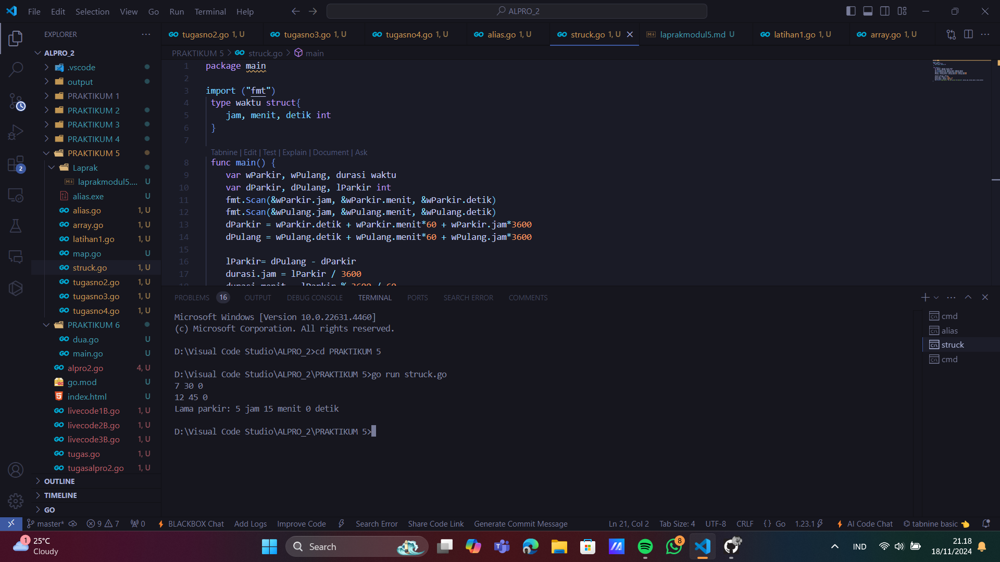

# <h1 align="center">LAPORAN PRAKTIKUM MODUL 5 : STRUCK DAN ARRAY</h1>
## <p align="center">DHEVA DEWA SEPTIANTONI - 2311102324</p>

# LATIHAN
## 1. Alias(Type)

```go
package main

import "fmt"

type bilangan int
type pecahan float64

func main() {
	var a, b bilangan
	var hasil pecahan
	a = 9
	b = 5
	hasil = pecahan(a) / pecahan(b)
	fmt.Println(hasil)

}

```
### OUTPUT SCREENSHOT


## 2. Struct

```go
package main

import "fmt"

type waktu struct {
	jam, menit, detik int
}

func main() {
	var wParkir, wPulang, durasi waktu
	var dParkir, dPulang, lParkir int
	fmt.Scan(&wParkir.jam, &wParkir.menit, &wParkir.detik)
	fmt.Scan(&wPulang.jam, &wPulang.menit, &wPulang.detik)
	dParkir = wParkir.detik + wParkir.menit*60 + wParkir.jam*3600
	dPulang = wPulang.detik + wPulang.menit*60 + wPulang.jam*3600
	lParkir = dPulang - dParkir
	durasi.jam = lParkir % 3600 / 60
	durasi.menit = lParkir % 3600 / 60
	durasi.detik = lParkir % 3600 / 60
	fmt.Printf("Lama Parkir: %d jam %d menit %d detik", durasi.jam, durasi.menit, durasi.detik)
}

```
### OUTPUT SCREENSHOT



## 3. Array

```go
package main

import "fmt"

// Definisi tipe CircType
type CircType struct {
	Radius float64
}

// Definisi tipe NewType
type NewType struct {
	Name string
}

func main() {
	var (
		// Array arr mempunyai 73 elemen, masing-masing bertipe CircType
		arr [73]CircType

		// Array buf dengan 5 elemen, dengan nilai awal 7,3,5,2,11
		buf = [5]byte{7, 3, 5, 2, 11}

		// Array mhs berisi 2000 elemen NewType
		mhs [2000]NewType

		// Array dua dimensi rec berisi nilai float64
		rec [20][40]float64
	)

	// Mengisi beberapa elemen contoh
	arr[0] = CircType{Radius: 5.5}
	mhs[0] = NewType{Name: "Alice"}
	rec[0][0] = 3.14

	// Contoh penggunaan variabel
	fmt.Println("arr[0]:", arr[0])
	fmt.Println("buf:", buf)
	fmt.Println("mhs[0]:", mhs[0])
	fmt.Println("rec[0][0]:", rec[0][0])
}

```
### OUTPUT SCREENSHOT


## 4. Map

```go
package main

import "fmt"

func main() {
	// Membuat map dengan tipe string sebagai kunci dan integer sebagai nilai
	scores := map[string]int{
		"John": 90,
		"Anne": 85,
	}

	// Mengambil nilai dari kunci
	johnScore := scores["John"]
	fmt.Println("Nilai John:", johnScore)

	// Mengganti nilai dari kunci yang ada
	scores["John"] = 95
	fmt.Println("Nilai John setelah diganti:", scores["John"])

	// Menambah kunci baru dengan nilai
	scores["David"] = 88
	fmt.Println("Nilai David ditambahkan:", scores["David"])

	// Menghapus kunci dari map
	delete(scores, "Anne")
	fmt.Println("Map setelah kunci 'Anne' dihapus:", scores)

	// Mengecek apakah kunci ada dalam map
	if score, ada := scores["David"]; ada {
		fmt.Println("Nilai David ditemukan:", score)
	} else {
		fmt.Println("Nilai David tidak ditemukan")
	}
}


```
### OUTPUT SCREENSHOT


## 5. Latihan1

```go

package main

import (
	"fmt"
	"math"
)

// Definisi tipe bentukan untuk titik
type Titik struct {
	x int
	y int
}

// Definisi tipe bentukan untuk lingkaran
type Lingkaran struct {
	center Titik
	radius int
}

// Fungsi untuk menghitung jarak antara dua titik
func jarak(p Titik, q Titik) float64 {
	return math.Sqrt(float64((p.x-q.x)*(p.x-q.x) + (p.y-q.y)*(p.y-q.y)))
}

// Fungsi untuk menentukan apakah titik berada di dalam lingkaran
func didalam(c Lingkaran, p Titik) bool {
	return jarak(p, c.center) < float64(c.radius)
}

func main() {
	var (
		// Mengambil input untuk lingkaran 1
		lingkaran1 Lingkaran
		// Mengambil input untuk lingkaran 2
		lingkaran2 Lingkaran
		// Mengambil input untuk titik sembarang
		point Titik
	)

	// Input untuk lingkaran 1 (cx, cy, r)
	fmt.Println("Masukkan koordinat titik pusat dan radius lingkaran 1 (cx cy r):")
	fmt.Scan(&lingkaran1.center.x, &lingkaran1.center.y, &lingkaran1.radius)

	// Input untuk lingkaran 2 (cx, cy, r)
	fmt.Println("Masukkan koordinat titik pusat dan radius lingkaran 2 (cx cy r):")
	fmt.Scan(&lingkaran2.center.x, &lingkaran2.center.y, &lingkaran2.radius)

	// Input untuk titik sembarang (x, y)
	fmt.Println("Masukkan koordinat titik sembarang (x y):")
	fmt.Scan(&point.x, &point.y)

	// Mengecek posisi titik terhadap kedua lingkaran
	inLingkaran1 := didalam(lingkaran1, point)
	inLingkaran2 := didalam(lingkaran2, point)

	if inLingkaran1 && inLingkaran2 {
		fmt.Println("Titik di dalam lingkaran 1 dan 2")
	} else if inLingkaran1 {
		fmt.Println("Titik di dalam lingkaran 1")
	} else if inLingkaran2 {
		fmt.Println("Titik di dalam lingkaran 2")
	} else {
		fmt.Println("Titik di luar lingkaran 1 dan 2")
	}
}

```
### OUTPUT SCREENSHOT


# TUGAS
## 1. TugasNo2

```go

// PROGRAM OPERASI ARRAY
package main

import (
	"fmt"  // Mengimpor paket fmt untuk I/O
	"math" // Mengimpor paket math untuk operasi matematika
)

// Fungsi untuk menampilkan seluruh elemen array
func tampilkanSEluruhArray(array_324 []int) { // array_324 - array dari tipe int yang ingin ditampilkan
	fmt.Println("Seluruh isi array:", array_324)
}

// Fungsi untuk menampilkan elemen array dengan indeks ganjil
func tampilkanIndeksGanjil(array_324 []int) { // array_324 - array dari tipe int
	fmt.Print("Elemen dengan indeks ganjil: ")
	for _, value_324 := range array_324 { // Loop untuk setiap elemen dalam array
		if value_324%2 != 0 { // Memeriksa apakah elemen adalah ganjil
			fmt.Print(value_324, " ")
		}
	}
	fmt.Println()
}

// Fungsi untuk menampilkan elemen array dengan indeks genap
func tampilkanIndeksGenap(array_324 []int) { // array_324 - array dari tipe int
	fmt.Print("Elemen dengan indeks genap: ")
	for _, value_324 := range array_324 { // Loop untuk setiap elemen dalam array
		if value_324%2 == 0 && value_324 != 0 { // Memeriksa apakah elemen adalah genap dan bukan nol
			fmt.Print(value_324, " ")
		}
	}
	fmt.Println()
}

// Fungsi untuk menampilkan elemen array pada indeks kelipatan x_324
func tampilkanKelipatanX(array_324 []int, x_324 int) { // array_324 - array dari tipe int, x_324 - nilai kelipatan indeks
	fmt.Printf("Elemen pada indeks kelipatan %d: ", x_324)
	for i_324 := x_324 - 1; i_324 < len(array_324); i_324 += x_324 { // Loop untuk setiap elemen pada indeks kelipatan x_324
		if array_324[i_324] != 0 { // Memeriksa apakah elemen bukan nol
			fmt.Print(array_324[i_324], " ")
		}
	}
	fmt.Println()
}

// Fungsi untuk menghapus elemen array pada indeks tertentu
func hapusElemen(array_324 []int, idx_324 int) []int { // array_324 - array dari tipe int, idx_324 - indeks yang akan dihapus
	return append(array_324[:idx_324], array_324[idx_324+1:]...) // Mengembalikan array baru dengan elemen yang telah dihapus
}

// Fungsi untuk menghitung rata-rata elemen array
func tampilkanRataRata(array_324 []int) float64 { // array_324 - array dari tipe int
	sum_324 := 0                           // Variabel untuk menyimpan jumlah elemen
	for _, value_324 := range array_324 { // Loop untuk setiap elemen dalam array
		sum_324 += value_324 // Menambahkan elemen ke jumlah total
	}
	return float64(sum_324) / float64(len(array_324)) // Mengembalikan rata-rata dalam tipe float64
}

// Fungsi untuk menghitung deviasi standar dari elemen array
func tampilkanStandarDeviasi(array_324 []int, rata float64) float64 { // array_324 - array dari tipe int, rata - rata-rata elemen array
	sumSquares_324 := 0.0                  // Variabel untuk menyimpan jumlah kuadrat selisih
	for _, value_324 := range array_324 { // Loop untuk setiap elemen dalam array
		sumSquares_324 += math.Pow(float64(value_324)-rata, 2) // Menghitung kuadrat selisih setiap elemen dari rata-rata
	}
	return math.Sqrt(sumSquares_324 / float64(len(array_324))) // Mengembalikan akar kuadrat dari jumlah kuadrat selisih dibagi jumlah elemen
}

// Fungsi untuk menghitung frekuensi kemunculan elemen tertentu dalam array
func tampilkanFrekuensi(array_324 []int, target_324 int) int { // array_324 - array dari tipe int, target_324 - nilai yang ingin dihitung frekuensinya
	count_324 := 0                         // Variabel untuk menghitung frekuensi
	for _, value_324 := range array_324 { // Loop untuk setiap elemen dalam array
	 if value_324 == target_324 { // Memeriksa apakah elemen sama dengan target_324
			count_324++ // Menambahkan 1 ke frekuensi jika cocok
		}
	}
	return count_324 // Mengembalikan frekuensi kemunculan target_324
}

func main() {
	var n_324, x_324, hapusIndeks_324, target_324 int

	// Input jumlah elemen array dari pengguna
	fmt.Print("Masukkan jumlah elemen array (n): ")
	fmt.Scan(&n_324) // Membaca jumlah elemen array

	// Membuat array dengan ukuran sesuai input
	dataArray_324 := make([]int, n_324)        // Membuat array dengan panjang n_324
	for i_324 := 0; i_324 < n_324; i_324++ { // Loop untuk mengisi elemen array
		fmt.Printf("Masukkan nilai untuk elemen ke-%d: ", i_324)
		fmt.Scan(&dataArray_324[i_324]) // Membaca nilai elemen dari pengguna
	}

	// Loop untuk menampilkan menu operasi array
	for {
		fmt.Println("1. Tampilkan seluruh isi array")
		fmt.Println("2. Tampilkan elemen dengan nilai ganjil")
		fmt.Println("3. Tampilkan elemen dengan nilai genap")
		fmt.Println("4. Tampilkan elemen pada indeks kelipatan x")
		fmt.Println("5. Hapus elemen pada indeks tertentu")
		fmt.Println("6. Tampilkan rata-rata dari elemen array")
		fmt.Println("7. Tampilkan standar deviasi elemen array")
		fmt.Println("8. Tampilkan frekuensi dari suatu bilangan")
		fmt.Println("9. Keluar")

		// Input pilihan_324 operasi dari pengguna
		var pilihan_324 int
		fmt.Print("Masukkan Nomor Operasi yang dipilih: ")
		fmt.Scan(&pilihan_324) // Membaca pilihan_324 operasi dari pengguna

		// Menjalankan operasi sesuai pilihan_324 pengguna
		switch pilihan_324 {
		case 1:
			tampilkanSEluruhArray(dataArray_324) // Menampilkan seluruh isi array

		case 2:
			tampilkanIndeksGanjil(dataArray_324) // Menampilkan elemen dengan nilai ganjil

		case 3:
			tampilkanIndeksGenap(dataArray_324) // Menampilkan elemen dengan nilai genap

		case 4:
			fmt.Print("Masukkan nilai (x) untuk kelipatan indeks: ")
			fmt.Scan(&x_324)                           // Membaca nilai x_324 dari pengguna
			tampilkanKelipatanX(dataArray_324, x_324) // Menampilkan elemen pada indeks kelipatan x_324

		case 5:
			fmt.Print("Masukkan indeks yang akan dihapus: ")
			fmt.Scan(&hapusIndeks_324)                                          // Membaca indeks yang akan dihapus
			if hapusIndeks_324 >= 0 && hapusIndeks_324 < len(dataArray_324) { // Memeriksa apakah indeks valid
				dataArray_324 = hapusElemen(dataArray_324, hapusIndeks_324) // Menghapus elemen pada indeks tertentu
				tampilkanSEluruhArray(dataArray_324)                          // Menampilkan array setelah elemen dihapus
			} else {
				fmt.Println("Indeks tidak valid!") // Menampilkan pesan jika indeks tidak valid
			}

		case 6:
			mean_324 := tampilkanRataRata(dataArray_324)          // Menghitung rata-rata elemen array
			fmt.Printf("Rata-rata elemen array: %.2f\n", mean_324) // Menampilkan rata-rata elemen array

		case 7:
			mean_324 := tampilkanRataRata(dataArray_324)                            // Menghitung rata-rata elemen array
			standarDeviasi_324 := tampilkanStandarDeviasi(dataArray_324, mean_324) // Menghitung deviasi standar elemen array
			fmt.Printf("Standar deviasi elemen array: %.2f\n", standarDeviasi_324)   // Menampilkan deviasi standar elemen array

		case 8:
			fmt.Print("Masukkan nilai untuk mencari frekuensi: ")
			fmt.Scan(&target_324)                                                         // Membaca nilai target_324 dari pengguna
			frekuensi_324 := tampilkanFrekuensi(dataArray_324, target_324)              // Menghitung fre kuensi target_324 dalam array
			fmt.Printf("Frekuensi %d dalam array: %d kali\n", target_324, frekuensi_324) // Menampilkan frekuensi target_324

		case 9:
			fmt.Println("Keluar dari program.") // Keluar dari program
			return

		default:
			fmt.Println("Pilihan tidak valid!") // Menampilkan pesan jika pilihan_324 tidak valid
		}
	}
}

```
### OUTPUT SCREENSHOT


## 2. TugasNo3

```go

// PROGRAM UNTUK MEREKAP SKOR PERTANDINGAN BOLA
package main

import "fmt" // Mengimpor paket fmt untuk I/O

func main() {
	// Deklarasi variabel untuk nama klub A dan klub B
	var klubA_324, klubB_324 string
	// Deklarasi variabel untuk skor masing-masing klub
	var scoreA_324, scoreB_324 int
	// Slice untuk menyimpan hasil pertandingan
	hasil_324 := []string{}
	// Variabel untuk menghitung jumlah pertandingan
	jumlahMatch_324 := 1

	// Input nama klub A
	fmt.Print("Klub A: ")
	fmt.Scan(&klubA_324)
	// Input nama klub B
	fmt.Print("Klub B: ")
	fmt.Scan(&klubB_324)

	// Loop untuk input skor pertandingan
	for {
		// Input skor pertandingan untuk masing-masing klub
		fmt.Printf("Pertandingan %d: ", jumlahMatch_324)
		fmt.Scan(&scoreA_324, &scoreB_324)

		// Jika skor negatif, keluar dari loop
		if scoreA_324 < 0 || scoreB_324 < 0 {
			break
		}

		// Menentukan pemenang atau draw
		if scoreA_324 > scoreB_324 {
			hasil_324 = append(hasil_324, klubA_324)
		} else if scoreB_324 > scoreA_324 {
			hasil_324 = append(hasil_324, klubB_324)
		} else {
			hasil_324 = append(hasil_324, "Draw")
		}

		// Tambah jumlah pertandingan
		jumlahMatch_324++
	}

	// Menampilkan hasil pertandingan
	fmt.Println("\nDaftar hasil pertandingan:")
	for i_324, poin_324 := range hasil_324 {
		if poin_324 == "Draw" {
			fmt.Printf("Hasil %d: Draw\n", i_324+1)
		} else {
			fmt.Printf("Hasil %d: %s\n", i_324+1, poin_324)
		}
	}

	// Menampilkan pesan bahwa pertandingan selesai
	fmt.Println("Pertandingan selesai")
}

```
### OUTPUT SCREENSHOT


## 3. TugasNo4

```go

// PROGRAM PALINDROM
package main

import (
	"bufio"   // bufio menyediakan buffered I/O, digunakan untuk membaca input dari pengguna
	"fmt"     // Mengimpor paket fmt untuk I/O
	"os"      // untuk bekerja dengan sistem operasi, seperti membaca input
	"strings" // untuk memanipulasi string, seperti perubahan huruf besar/kecil
)

const NMAX int = 127 // NMAX adalah konstanta batas dari maksimum elemen array

type tabel [NMAX]rune // tabel adalah array karakter dengan batas maksimum NMAX, dan rune berfungsi untuk menyimpan karakter unicode atau encoding karakter

// Fungsi untuk isi Array
/*
I.S. Data tersedia dalam piranti masukan
F.S. Array t berisi sejumlah n karakter yang dimasukkan user,

	Proses input selama karakter bukanlah TITIK dan n <= NMAX
*/
func isiArray(t *tabel, n *int, line string) {
	*n = 0                      // inisialisasi 0 untuk jumlah elemen array
	for _, char := range line { // untuk setiap karakter pada baris input
		if *n >= NMAX { // jika jumlah elemen array sudah mencapai batas maksimum
			break // hentikan loop
		}
		t[*n] = char // masukkan karakter ke dalam array
		*n++         // tambahkan jumlah elemen array
	}
}

// Fungsi untuk cetak Array
/*
I.S. Terdefinisi array t yang berisi sejumlah n karakter
F.S. n karakter dalam array muncul di layar
*/
func cetakArray(t tabel, n int) {
	for i := 0; i < n; i++ { // untuk setiap elemen pada array
		fmt.Print(string(t[i]), " ") // cetak elemen
	}
	fmt.Println() // mencetak baris baru setelah mencetak semua elemen
}

// Fungsi untuk membalikkan isi array
/*
I.S. Terdefinisi array t yang berisi sejumlah n karakter
F.S. Urutan isi array t terbalik
*/
func balikanArray(t *tabel, n int) {
	for i := 0; i < n/2; i++ { // untuk setiap elemen pada setengah array
		t[i], t[n-1-i] = t[n-1-i], t[i] // tukar elemen
	}
}

// Fungsi utama untuk memeriksa apakah array membentuk palindrom
/*
I.S. Terdefinisi array t yang berisi sejumlah n karakter
F.S. Menghasilkan nilai true jika array t adalah palindrom, false jika tidak
*/
func palindrom(t tabel, n int) bool {
	for i := 0; i < n/2; i++ { // untuk setiap elemen pada setengah array
		if t[i] != t[n-1-i] { // jika elemen tidak sama
			return false // array tidak membentuk palindrom
		}
	}
	return true // array membentuk palindrom
}

// Fungsi utama
func main() {
	// si array tab dengan memanggil prosedur isiArray
	var tab tabel                         // Deklarasi variabel array
	var m int                             // Deklarasi variabel untuk jumlah elemen
	scanner := bufio.NewScanner(os.Stdin) // Membaca input dari pengguna
	fmt.Println("Masukkan teks (ketik '.' untuk berhenti): ")

	for scanner.Scan() { // Loop untuk membaca input pengguna
		line := scanner.Text()            // Membaca satu baris input
		if strings.ToUpper(line) == "." { // Jika input adalah titik, hentikan loop
			break // keluar dari loop
		}

		// Mengisi array dengan baris input
		isiArray(&tab, &m, line) // si array tab dengan memanggil prosedur isiArray

		// Menampilkan array asli
		fmt.Print("Teks         : ")
		cetakArray(tab, m) // Memanggil fungsi untuk mencetak array

		// Balikan isi array tab dengan memanggil balkanArray
		balikanArray(&tab, m) // Balikian isi array tab
		fmt.Print("Reverse Teks : ")
		cetakArray(tab, m) // Cetak isi array tab

		// Mengecek dan menampilkan hasil palindrom
		isPalindrom := palindrom(tab, m)           // Memeriksa apakah teks merupakan palindrom
		fmt.Println("Palindrom    ?", isPalindrom) // Menampilkan hasil palindrom
		fmt.Println()                              // mencetak baris baru untuk pemisahan
	}
}

```
### OUTPUT SCREENSHOT

