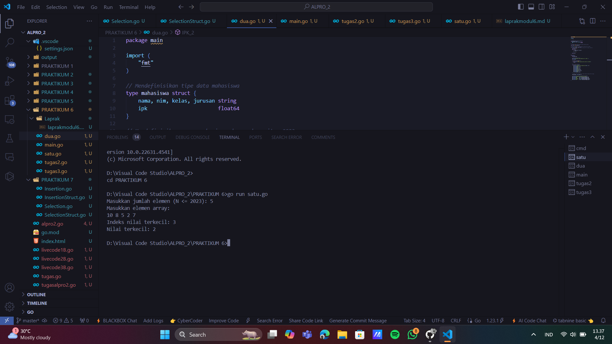
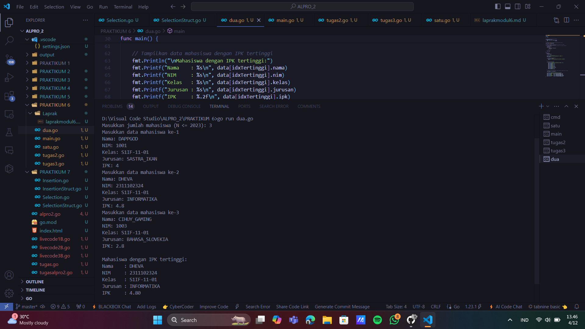
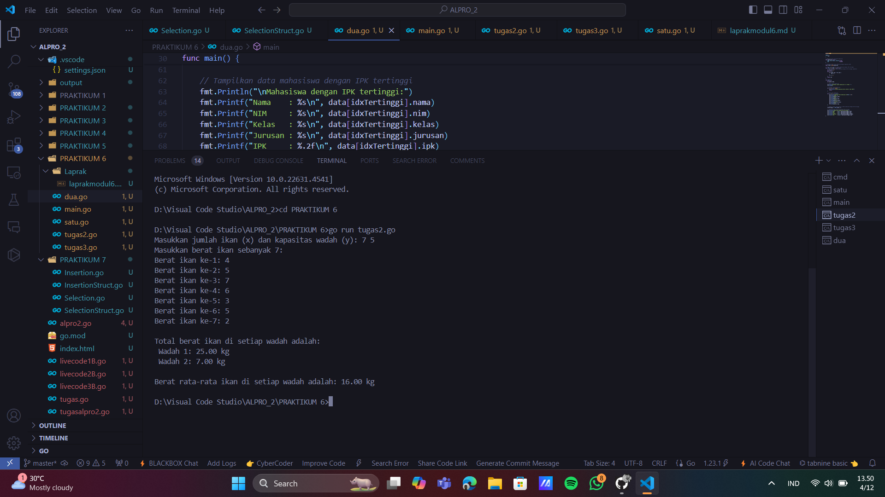
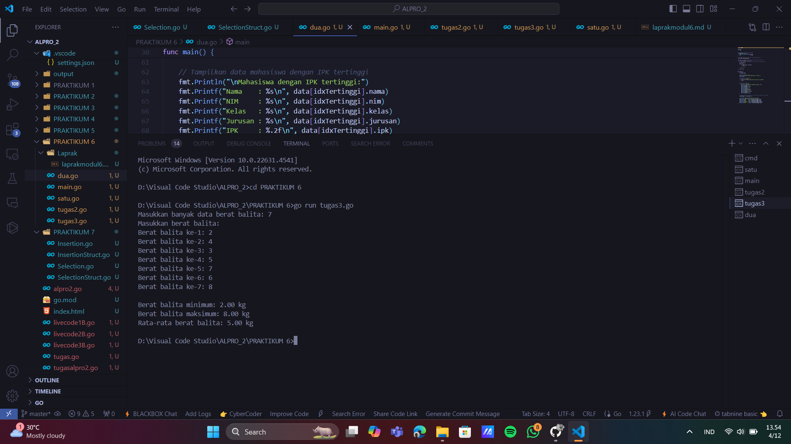

# <h1 align="center">LAPORAN PRAKTIKUM MODUL 6 : PENCARIAN NILAI EKSTRIM PADA HIMPUNAN DATA</h1>
## <p align="center">DHEVA DEWA SEPTIANTONI - 2311102324</p>

# LATIHAN
## 1. satu.go

```go
package main

import (
	"fmt"
)

type arrInt [2023]int

// Fungsi untuk mencari indeks dari nilai terkecil
func terkecil_2(tabInt arrInt, n int) int {
	var idx int = 0 // indeks data pertama
	var j int = 1   // pencarian dimulai dari data kedua
	for j < n {
		if tabInt[idx] > tabInt[j] { // cek apakah tabInt[j] lebih kecil dari tabInt[idx]
			idx = j // update idx ke indeks baru yang nilainya lebih kecil
		}
		j = j + 1
	}
	return idx // mengembalikan indeks dari nilai terkecil
}

func main() {
	var n int
	var data arrInt

	// Input jumlah elemen N
	fmt.Print("Masukkan jumlah elemen (N <= 2023): ")
	fmt.Scan(&n)

	// Validasi N agar tidak melebihi kapasitas array
	if n <= 0 || n > 2023 {
		fmt.Println("Jumlah elemen harus antara 1 dan 2023")
		return
	}

	// Input elemen-elemen array
	fmt.Println("Masukkan elemen array:")
	for i := 0; i < n; i++ {
		fmt.Scan(&data[i])
	}

	// Panggil fungsi untuk mencari indeks nilai terkecil
	idxTerkecil := terkecil_2(data, n)
	fmt.Printf("Indeks nilai terkecil: %d\n", idxTerkecil)
	fmt.Printf("Nilai terkecil: %d\n", data[idxTerkecil])
}

```
### OUTPUT SCREENSHOT


Kode di atas digunakan untuk mencari nilai terkecil dalam array hingga 2023 elemen, menampilkan indeks dan nilai terkecil tersebut setelah validasi input. Lebih jelasnya seperti pada output diatas.

## 2. dua.go

```go
package main

import (
	"fmt"
)

// Mendefinisikan tipe data mahasiswa
type mahasiswa struct {
	nama, nim, kelas, jurusan string
	ipk                       float64
}

// Mendefinisikan array mahasiswa dengan kapasitas 2023
type arrMhs [2023]mahasiswa

// Fungsi untuk mencari indeks mahasiswa dengan IPK tertinggi
func IPK_2(T arrMhs, n int) int {
	// idx menyimpan indeks mahasiswa dengan IPK tertinggi sementara
	var idx int = 0
	var j int = 1
	for j < n {
		if T[idx].ipk < T[j].ipk {
			idx = j
		}
		j = j + 1
	}
	return idx
}

func main() {
	var n int
	var data arrMhs

	// Input jumlah mahasiswa
	fmt.Print("Masukkan jumlah mahasiswa (N <= 2023): ")
	fmt.Scan(&n)

	// Validasi jumlah mahasiswa
	if n <= 0 || n > 2023 {
		fmt.Println("Jumlah mahasiswa harus antara 1 dan 2023")
		return
	}

	// Input data mahasiswa
	for i := 0; i < n; i++ {
		fmt.Printf("Masukkan data mahasiswa ke-%d\n", i+1)
		fmt.Print("Nama: ")
		fmt.Scan(&data[i].nama)
		fmt.Print("NIM: ")
		fmt.Scan(&data[i].nim)
		fmt.Print("Kelas: ")
		fmt.Scan(&data[i].kelas)
		fmt.Print("Jurusan: ")
		fmt.Scan(&data[i].jurusan)
		fmt.Print("IPK: ")
		fmt.Scan(&data[i].ipk)
	}

	// Panggil fungsi untuk mencari indeks mahasiswa dengan IPK tertinggi
	idxTertinggi := IPK_2(data, n)

	// Tampilkan data mahasiswa dengan IPK tertinggi
	fmt.Println("\nMahasiswa dengan IPK tertinggi:")
	fmt.Printf("Nama    : %s\n", data[idxTertinggi].nama)
	fmt.Printf("NIM     : %s\n", data[idxTertinggi].nim)
	fmt.Printf("Kelas   : %s\n", data[idxTertinggi].kelas)
	fmt.Printf("Jurusan : %s\n", data[idxTertinggi].jurusan)
	fmt.Printf("IPK     : %.2f\n", data[idxTertinggi].ipk)
}

```
### OUTPUT SCREENSHOT


Kode di atas digunakan untuk mendata mahasiswa (nama, NIM, kelas, jurusan, dan IPK), mencari mahasiswa dengan IPK tertinggi, dan menampilkan informasi lengkapnya. Lebih jelasnya seperti pada output diatas.

## 3. main.go

```go
package main

import (
	"fmt"
)

func main() {
	var n int
	fmt.Print("Masukkan jumlah anak kelinci: ")
	fmt.Scan(&n)

	if n <= 0 || n > 1000 {
		fmt.Println("Jumlah anak kelinci harus antara 1 dan 1000")
		return
	}

	weights := make([]float64, n)
	fmt.Println("Masukkan berat anak kelinci:")
	for i := 0; i < n; i++ {
		fmt.Scan(&weights[i])
	}

	minWeight, maxWeight := weights[0], weights[0]

	for _, weight := range weights[1:] {
		if weight < minWeight {
			minWeight = weight
		}
		if weight > maxWeight {
			maxWeight = weight
		}
	}

	fmt.Printf("Berat kelinci terkecil: %.2f\n", minWeight)
	fmt.Printf("Berat kelinci terbesar: %.2f\n", maxWeight)
}

```
### OUTPUT SCREENSHOT


Kode di atas digunakan untuk menghitung berat terkecil dan terbesar dari sejumlah anak kelinci (maksimal 1000) berdasarkan input berat yang diberikan, kemudian menampilkan hasilnya. Lebih jelasnya seperti pada output diatas.

# TUGAS
## 1. Tugas2

```go
package main

import (
	"fmt" 
)

const maxKapasitas_2324 = 1000 // Konstanta untuk kapasitas maksimum jumlah ikan

// Fungsi untuk menghitung total berat ikan di setiap wadah dan rata-rata berat per wadah
func hitungBerat_2324(x_2324 int, y_2324 int, beratIkan_2324 []float64) ([]float64, float64) {
	// Hitung jumlah wadah yang diperlukan
	jumlahWadah_2324 := (x_2324 + y_2324 - 1) / y_2324   // Pembulatan ke atas jika ada sisa ikan
	beratWadah_2324 := make([]float64, jumlahWadah_2324) // Slice untuk menyimpan berat total setiap wadah

	// Distribusi berat ikan ke setiap wadah
	for i_2324 := 0; i_2324 < x_2324; i_2324++ { // Iterasi untuk semua ikan
		indeksWadah_2324 := i_2324 / y_2324                         // Tentukan indeks wadah berdasarkan kapasitas
		beratWadah_2324[indeksWadah_2324] += beratIkan_2324[i_2324] // Tambahkan berat ikan ke wadah yang sesuai
	}

	// Hitung rata-rata berat ikan per wadah
	totalBerat_2324 := 0.0 // Variabel untuk menyimpan total berat semua ikan
	for _, berat_2324 := range beratWadah_2324 {
		totalBerat_2324 += berat_2324 // Tambahkan berat wadah ke total
	}
	rataRataBerat_2324 := totalBerat_2324 / float64(jumlahWadah_2324) // Hitung rata-rata berat ikan

	return beratWadah_2324, rataRataBerat_2324 // Kembalikan hasil berupa total berat tiap wadah dan rata-rata berat
}

func main() {
	var x_2324, y_2324 int // Variabel untuk jumlah ikan dan kapasitas wadah

	// Input jumlah ikan (x) dan kapasitas wadah (y)
	fmt.Print("Masukkan jumlah ikan (x) dan kapasitas wadah (y): ")
	fmt.Scan(&x_2324, &y_2324)

	// Validasi input
	if x_2324 <= 0 || y_2324 <= 0 { // Pastikan jumlah ikan dan kapasitas wadah valid
		fmt.Println("Jumlah ikan dan kapasitas wadah harus lebih dari 0 dan tidak boleh negatif.")
		return // Keluar dari program jika input tidak valid
	}

	if x_2324 > maxKapasitas_2324 { // Validasi maksimum jumlah ikan
		fmt.Printf("Jumlah ikan tidak boleh lebih dari %d.\n", maxKapasitas_2324)
		return // Keluar dari program jika jumlah ikan melebihi kapasitas maksimum
	}

	// Input berat masing-masing ikan
	beratIkan_2324 := make([]float64, x_2324) // Slice untuk menyimpan berat tiap ikan
	fmt.Printf("Masukkan berat ikan sebanyak %d:\n", x_2324)
	for i_2324 := 0; i_2324 < x_2324; i_2324++ { // Iterasi untuk input berat ikan
		fmt.Printf("Berat ikan ke-%d: ", i_2324+1)
		fmt.Scan(&beratIkan_2324[i_2324]) // Baca berat ikan
		if beratIkan_2324[i_2324] < 0 {   // Validasi berat ikan tidak boleh negatif
			fmt.Println("Berat ikan tidak boleh negatif.")
			return // Keluar dari program jika ada berat negatif
		}
	}

	// Panggil fungsi untuk menghitung total berat dan rata-rata
	beratWadah_2324, rataRataBerat_2324 := hitungBerat_2324(x_2324, y_2324, beratIkan_2324)

	// Output total berat ikan di setiap wadah
	fmt.Println("\nTotal berat ikan di setiap wadah adalah:")
	for i_2324, berat_2324 := range beratWadah_2324 {
		fmt.Printf(" Wadah %d: %.2f kg\n", i_2324+1, berat_2324) // Tampilkan berat tiap wadah
	}

	// Output rata-rata berat ikan per wadah
	fmt.Printf("\nBerat rata-rata ikan di setiap wadah adalah: %.2f kg\n", rataRataBerat_2324)
}

```
### OUTPUT SCREENSHOT


## 2. Tugas3.

```go

package main

import (
	"fmt" // Mengimpor paket fmt untuk I/O
)

// Deklarasi tipe array untuk menyimpan berat balita
type arrBalita [100]float64 // Array untuk berat balita dengan kapasitas maksimum 100

// Fungsi untuk menghitung berat minimum dan maksimum dalam array
func hitungMinMax(arrBerat_2138 arrBalita, n_2138 int, bMin_2138, bMax_2138 *float64) {
	*bMin_2138 = arrBerat_2138[0] // Inisialisasi nilai minimum dengan elemen pertama array
	*bMax_2138 = arrBerat_2138[0] // Inisialisasi nilai maksimum dengan elemen pertama array

	// Perulangan untuk membandingkan nilai array dengan minimum dan maksimum saat ini
	for i_2138 := 1; i_2138 < n_2138; i_2138++ { // Mulai dari indeks kedua karena elemen pertama sudah diproses
		if arrBerat_2138[i_2138] < *bMin_2138 { // Jika berat balita lebih kecil dari minimum saat ini
			*bMin_2138 = arrBerat_2138[i_2138] // Perbarui nilai minimum
		}
		if arrBerat_2138[i_2138] > *bMax_2138 { // Jika berat balita lebih besar dari maksimum saat ini
			*bMax_2138 = arrBerat_2138[i_2138] // Perbarui nilai maksimum
		}
	}
}

// Fungsi untuk menghitung rata-rata berat balita
func hitungRata(arrBerat_2138 arrBalita, n_2138 int) float64 {
	total_2138 := 0.0 // Variabel untuk menyimpan total_2138 berat semua balita

	for i_2138 := 0; i_2138 < n_2138; i_2138++ { // Perulangan untuk menjumlahkan semua elemen array
		total_2138 += arrBerat_2138[i_2138] // Tambahkan berat balita ke total_2138
	}

	return total_2138 / float64(n_2138) // Hitung rata-rata dengan membagi total_2138 dengan jumlah balita
}

func main() {
	var n_2138 int                   // Variabel untuk jumlah balita
	var beratBalita_2138 arrBalita   // Array untuk menyimpan berat balita
	var bMin_2138, bMax_2138 float64 // Variabel untuk menyimpan nilai minimum dan maksimum

	// Input jumlah data berat balita
	fmt.Print("Masukkan banyak data berat balita: ") // Prompt pengguna untuk memasukkan jumlah balita
	fmt.Scan(&n_2138)                                // Membaca jumlah data balita dari input pengguna

	// Validasi input jumlah balita agar tidak melebihi kapasitas maksimum
	if n_2138 <= 0 || n_2138 > 100 { // Cek apakah jumlah balita valid (1 <= n_2138 <= 100)
		fmt.Println("Jumlah balita harus antara 1 dan 100.") // Pesan error jika input tidak valid
		return                                               // Keluar dari program jika input tidak valid
	}

	// Input berat balita
	fmt.Println("Masukkan berat balita:")        // Prompt untuk memasukkan berat setiap balita
	for i_2138 := 0; i_2138 < n_2138; i_2138++ { // Perulangan untuk membaca berat masing-masing balita
		fmt.Printf("Berat balita ke-%d: ", i_2138+1) // Tampilkan nomor balita
		fmt.Scan(&beratBalita_2138[i_2138])          // Baca berat balita dari input pengguna
	}

	// Panggil fungsi untuk menghitung nilai minimum dan maksimum
	hitungMinMax(beratBalita_2138, n_2138, &bMin_2138, &bMax_2138) // Menghitung nilai minimum dan maksimum

	// Panggil fungsi untuk menghitung rata-rata berat balita
	rataRata := hitungRata(beratBalita_2138, n_2138) // Menghitung rata-rata berat balita

	// Output hasil
	fmt.Printf("\nBerat balita minimum: %.2f kg\n", bMin_2138) // Tampilkan nilai minimum
	fmt.Printf("Berat balita maksimum: %.2f kg\n", bMax_2138)  // Tampilkan nilai maksimum
	fmt.Printf("Rata-rata berat balita: %.2f kg\n", rataRata)  // Tampilkan nilai rata-rata
}

```
### OUTPUT SCREENSHOT

